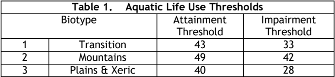
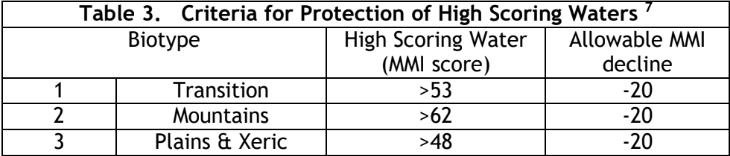
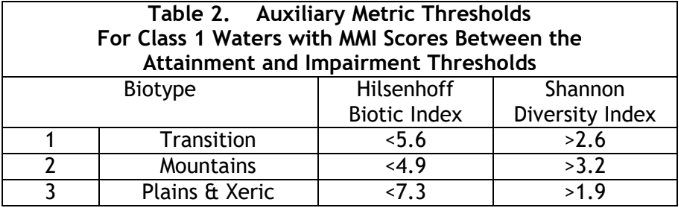

```{r setup, include=FALSE}
knitr::opts_chunk$set(echo = TRUE)

# Load libraries
library(here)        # For relative file paths
library(readxl)      # For reading in Excel files
library(data.table)
library(tidyverse)   # For tidy data management
library(lubridate)   # For working with dates
library(glmmTMB)     # For stat tests
```

Updates from v2.0: Update plots to compound/multi-panel.

```{r loadData}
# specify folder path where results are saved
loadPath <- "C:/Users/GeorgeValentine/Box/Lake George Dam Removal/Sample Data/Macroinvertebrates/Results from NAMC/LakeGeorge_historical_CO_MMI_Jan_2026.xlsx"

#----------------------------------------------------------------------------------
# Load sample data
macro_sampleData <- read_excel(loadPath,sheet = "Site & sample info")

# make "Collection date" a date-type
macro_sampleData$`Collection Date` <- date(macro_sampleData$`Collection Date`)

# re-order the "Visit ID" column as a factor
macro_sampleData$`Visit ID` <- factor(macro_sampleData$`Visit ID`,
                                       levels = c("preremoval", "post-removal"))

# Add a Before_After column based on Visit ID and order it
macro_sampleData <- macro_sampleData %>% 
  mutate(Before_After = case_when(`Visit ID` == "preremoval" ~ "Before",
                                  `Visit ID` == "post-removal" ~ "After"))

macro_sampleData$Before_After <- factor(macro_sampleData$Before_After,
                                   levels = c("Before",
                                              "After"))

# Classify samples based on date and order as a factor
macro_sampleData <- macro_sampleData %>%
  mutate(Sample = case_when(`Collection Date` < '2023-9-1' ~ "Summer 2023",
                            `Collection Date` > '2023-9-1' & `Collection Date` < '2023-12-31' ~ "Fall 2023",
                            `Collection Date` > '2024-5-31' & `Collection Date` < '2024-9-1' ~ "Summer 2024",
                            `Collection Date` > '2024-9-1' & `Collection Date` < '2024-12-31' ~ "Fall 2024",
                            `Collection Date` > '2025-5-31' & `Collection Date` < '2025-9-1' ~ "Summer 2025",
                            `Collection Date` > '2025-9-1' & `Collection Date` < '2025-12-31' ~ "Fall 2025"))

macro_sampleData$Sample <- factor(macro_sampleData$Sample,
                               levels = c("Summer 2023",
                                          "Fall 2023",
                                          "Summer 2024",
                                          "Fall 2024",
                                          "Summer 2025",
                                          "Fall 2025"))

# rename and order sites as factor from upstream to downstream
macro_sampleData <- macro_sampleData %>% 
  mutate(Site = case_when(`Site ID` == "LkGeorge.CTRL_1" ~ "Control 1",
                          `Site ID` == "LkGeorge.CTRL_2" ~ "Control 2",
                          `Site ID` == "LkGeorge.CTRL_3" ~ "Control 3",
                          `Site ID` == "LkGeorge.UPSTRM_1" ~ "Upstream 1",
                          `Site ID` == "LkGeorge.UPSTRM_2" ~ "Upstream 2",
                          `Site ID` == "LkGeorge.UPSTRM_3" ~ "Upstream 3",
                          `Site ID` == "LkGeorge.DWNSTRM_1" ~ "Downstream 1",
                          `Site ID` == "LkGeorge.DWNSTRM_2" ~ "Downstream 2",
                          `Site ID` == "LkGeorge.DWNSTRM_3" ~ "Downstream 3"))

macro_sampleData$Site <- factor(macro_sampleData$Site,
                                    levels = c("Control 1",
                                               "Control 2",
                                               "Control 3",
                                               "Upstream 1",
                                               "Upstream 2",
                                               "Upstream 3",
                                               "Downstream 1",
                                               "Downstream 2",
                                               "Downstream 3"))

# Make a Reach column and order it
macro_sampleData <- macro_sampleData %>% 
    mutate(Reach = case_when(`Site ID` == "LkGeorge.CTRL_1" ~ "Control",
                          `Site ID` == "LkGeorge.CTRL_2" ~ "Control",
                          `Site ID` == "LkGeorge.CTRL_3" ~ "Control",
                          `Site ID` == "LkGeorge.UPSTRM_1" ~ "Upstream",
                          `Site ID` == "LkGeorge.UPSTRM_2" ~ "Upstream",
                          `Site ID` == "LkGeorge.UPSTRM_3" ~ "Upstream",
                          `Site ID` == "LkGeorge.DWNSTRM_1" ~ "Downstream",
                          `Site ID` == "LkGeorge.DWNSTRM_2" ~ "Downstream",
                          `Site ID` == "LkGeorge.DWNSTRM_3" ~ "Downstream"))

macro_sampleData$Reach <- factor(macro_sampleData$Reach,
                                    levels = c("Control",
                                               "Upstream",
                                               "Downstream"))

# Make a control/study column and order it
macro_sampleData <- macro_sampleData %>% 
  mutate(Control_Impact = case_when(`Site ID` == "LkGeorge.CTRL_1" ~ "Control",
                          `Site ID` == "LkGeorge.CTRL_2" ~ "Control",
                          `Site ID` == "LkGeorge.CTRL_3" ~ "Control",
                          `Site ID` == "LkGeorge.UPSTRM_1" ~ "Impact",
                          `Site ID` == "LkGeorge.UPSTRM_2" ~ "Impact",
                          `Site ID` == "LkGeorge.UPSTRM_3" ~ "Impact",
                          `Site ID` == "LkGeorge.DWNSTRM_1" ~ "Impact",
                          `Site ID` == "LkGeorge.DWNSTRM_2" ~ "Impact",
                          `Site ID` == "LkGeorge.DWNSTRM_3" ~ "Impact"))

macro_sampleData$Control_Impact <- factor(macro_sampleData$Control_Impact,
                                   levels = c("Control",
                                              "Impact"))

# Make a "Community" column to be used in the NMDS
macro_sampleData <- macro_sampleData %>% 
  mutate(Community = paste(Reach, Before_After))

macro_sampleData$Community = factor(macro_sampleData$Community,
                                    levels = c("Control Before",
                                               "Control After",
                                               "Upstream Before",
                                               "Upstream After",
                                               "Downstream Before",
                                               "Downstream After"))

#----------------------------------------------------------------------------------
# Load multi-metric index data (CO MMI v5)
macro_indices <- read_excel(loadPath, sheet = "Index results")
macro_indices <- macro_indices %>% 
  filter(`Index name` == "CO Ecological Data Application System Multimetric Index - Transition 2025")

#----------------------------------------------------------------------------------
# Load metrics data
macro_metrics <- read_excel(loadPath, sheet = "Metrics")

macro_metrics$`Sample ID` <- as.numeric(macro_metrics$`Sample ID`)

# join macro_indices and macro_metrics to macro_sampleData to create a combined dataframe
macro_data <- macro_sampleData %>% 
  left_join(macro_indices, by = "Sample ID", suffix = c("", ".duplicate")) %>% 
  left_join(macro_metrics, by = "Sample ID", suffix = c("", ".duplicate")) %>% 
  select(-ends_with(".duplicate"))

#----------------------------------------------------------------------------------
# Add metrics for EPTs
macro_data <- macro_data %>% 
  mutate(`Density - EPT` = `Density - Ephemeroptera` + `Density - Plecoptera` + `Density - Trichoptera`,
         `Unique Richness - EPT` = `Unique Richness - Ephemeroptera` + `Unique Richness - Plecoptera` + `Unique Richness - Trichoptera`)
```


# A Note on Filtering Data
Consider filtering out samples collected in Fall 2023 at Upstream 2 and from all the Upstream 1 samples. The Fall 2023 sample was collected in early December, as soon as researchers had permission to re-enter the restoration site. Construction equipment was still in the river and the area was certainly not in a "post-restoration" state. The Upstream 1 site ended up being slightly upstream of the dam impoundment, and so was not in the area affected by the dam removal. In a sense, it's more like a control reach than an impact reach becuase it didn't recieve the treatment.
```{r}
macro_data_filtered <- macro_data %>% 
  filter(`Sample ID` != 215075,
         Site != "Upstream 1")
```

## Data Visualizations
# MMI
The Colorado Ecological Data Application System Multimetric Index (MMI) is a bioassessment tool developed by the Colorado Water Quality Control Division with assistance from the US EPA to quantify the health of aquatic ecosystems within the state based on macroinvertebrate assemblages. It uses three Biotypes and assigns a score from 0-100. For more information, see the [Colorado Department of Public Health and the Environment's Policy Statement 10-1](https://www.coloradosmp.org/wp-content/uploads/2022/03/Policy-10-1-v.-2020.pdf), *Aquatic Life Use Attainment: Methodology to Determine Use Attainment for Rivers and Streams*. The study site in Elevenmile Canyon near lake George, CO falls within the *transition* biotype.

MMI scores are assessed as follows:





How has the MMI score of each site changed over the course of the study?
```{r}
macro_data %>% 
  ggplot(aes(x = Site, y = `Index Score`, fill = Sample)) +
  geom_bar(stat = 'identity', position = 'dodge') + 
  theme_classic() +
  theme(axis.text.x = element_text(angle=45, hjust = 1)) +
  labs(title = "Unfiltered Data") +
  # labels
  geom_hline(aes(yintercept = 33), linetype="dashed") +
  geom_hline(aes(yintercept = 43), linetype="dashed") +
  geom_hline(aes(yintercept = 53), linetype="dashed") +
  geom_text(aes(x = "Downstream 3", y = 32), label = "Impairment", size = 3) +
  geom_text(aes(x = "Downstream 3", y = 42), label = "Attainment", size = 3) +
  geom_text(aes(x = "Downstream 3", y = 52), label = "High-Scoring", size = 3)
```

```{r, warning = FALSE}
macro_data %>% 
  ggplot(aes(x = Sample, y = `Index Score`, group = 1)) +
  geom_line() + 
  geom_point() +
  theme_classic() +
  theme(axis.text.x = element_text(angle=45, hjust = 1)) +
  facet_wrap(~Site) +
  labs(y = "Colorado MMI Score",
       title = "Unfiltered Data") +
  #geom_vline(aes(xintercept = "Fall 2023"), linetype="dashed")

  # labels
  geom_hline(aes(yintercept = 33), linetype="dashed") +
  geom_hline(aes(yintercept = 43), linetype="dashed") +
  geom_hline(aes(yintercept = 53), linetype="dashed") +
  geom_text(aes(x = "Summer 2023", y = 32), label = "Impairment", size = 2.5) +
  geom_text(aes(x = "Summer 2023", y = 42), label = "Attainment", size = 2.5) +
  geom_text(aes(x = "Summer 2023", y = 52), label = "High-Scoring", size = 2.5)
```

```{r, warning = FALSE}
macro_data %>% 
  ggplot(aes(x = Sample, y = `Index Score`, color = Reach)) +
  geom_boxplot() +
  geom_line()+
  theme_classic() +
  theme(axis.text.x = element_text(angle=45, hjust = 1)) +
  labs(y = "Colorado MMI Score",
       title = "Filtered Data") +
  #geom_vline(aes(xintercept = "Fall 2023"), linetype="dashed")

  # labels
  geom_hline(aes(yintercept = 33), linetype="dashed") +
  geom_hline(aes(yintercept = 43), linetype="dashed") +
  geom_hline(aes(yintercept = 53), linetype="dashed") +
  geom_text(aes(x = "Summer 2023", y = 32), label = "Impairment", size = 2.5) +
  geom_text(aes(x = "Summer 2023", y = 42), label = "Attainment", size = 2.5) +
  geom_text(aes(x = "Summer 2023", y = 52), label = "High-Scoring", size = 2.5)
```

How has the MMI score of each study reach (i.e. control, upstream, downstream) changed over the course of the study?
```{r message=FALSE, warning=FALSE}
macro_data %>% 
  ggplot(aes(x = Reach, y = `Index Score`, color = Sample)) +
  geom_boxplot() +
  theme_classic() +
  labs(x = element_blank(),
       y = "Colorado MMI",
       color = element_blank(),
       title = "Unfiltered Data") +
  # labels
  geom_hline(aes(yintercept = 33), linetype="dashed") +
  geom_hline(aes(yintercept = 43), linetype="dashed") +
  geom_hline(aes(yintercept = 53), linetype="dashed") +
  geom_text(aes(x = "Downstream", y = 32), label = "Impaired", size = 3, color = "black", nudge_x = 0.4) +
  geom_text(aes(x = "Downstream", y = 44), label = "Unimpaired", size = 3, color = "black", nudge_x = 0.4) +
  geom_text(aes(x = "Downstream", y = 54), label = "High-Scoring", size = 3, color = "black", nudge_x = 0.4)

macro_data_filtered %>% 
  ggplot(aes(x = Reach, y = `Index Score`, color = Sample)) +
  geom_boxplot() +
  theme_classic() +
  labs(x = element_blank(),
       y = "Colorado MMI",
       color = element_blank(),
       title = "Filtered Data") +
  # labels
  geom_hline(aes(yintercept = 33), linetype="dashed") +
  geom_hline(aes(yintercept = 43), linetype="dashed") +
  geom_hline(aes(yintercept = 53), linetype="dashed") +
  geom_text(aes(x = "Downstream", y = 32), label = "Impaired", size = 3, color = "black", nudge_x = 0.4) +
  geom_text(aes(x = "Downstream", y = 44), label = "Unimpaired", size = 3, color = "black", nudge_x = 0.4) +
  geom_text(aes(x = "Downstream", y = 54), label = "High-Scoring", size = 3, color = "black", nudge_x = 0.4)
```

```{r message=FALSE, warning=FALSE}
macro_data %>% 
  ggplot(aes(x = Reach, y = `Index Score`, color = Before_After)) +
  geom_boxplot() +
  theme_classic() +
  labs(x = element_blank(),
       y = "Colorado MMI",
       color = element_blank(),
       title = "Unfiltered Data") +
  # labels
  geom_hline(aes(yintercept = 33), linetype="dashed") +
  geom_hline(aes(yintercept = 43), linetype="dashed") +
  geom_hline(aes(yintercept = 53), linetype="dashed") +
  geom_text(aes(x = "Downstream", y = 32), label = "Impaired", size = 3, color = "black", nudge_x = 0.4) +
  geom_text(aes(x = "Downstream", y = 44), label = "Unimpaired", size = 3, color = "black", nudge_x = 0.4) +
  geom_text(aes(x = "Downstream", y = 54), label = "High-Scoring", size = 3, color = "black", nudge_x = 0.4)

macro_data_filtered %>% 
  ggplot(aes(x = Reach, y = `Index Score`, color = Before_After)) +
  geom_boxplot() +
  theme_classic() +
  labs(x = element_blank(),
       y = "Colorado MMI",
       color = element_blank(),
       title = "Filtered Data") +
  # labels
  geom_hline(aes(yintercept = 33), linetype="dashed") +
  geom_hline(aes(yintercept = 43), linetype="dashed") +
  geom_hline(aes(yintercept = 53), linetype="dashed") +
  geom_text(aes(x = "Downstream", y = 32), label = "Impaired", size = 3, color = "black", nudge_x = 0.4) +
  geom_text(aes(x = "Downstream", y = 44), label = "Unimpaired", size = 3, color = "black", nudge_x = 0.4) +
  geom_text(aes(x = "Downstream", y = 54), label = "High-Scoring", size = 3, color = "black", nudge_x = 0.4)
```


What about the sites with MMI scores that fall between impairment and attainment? The CO MMI v5 update includes auxiliary thresholds for this determination based off of the Hilsenhoff Biotic Index and the Shannon Diversity Index:



```{r, warning = FALSE}
macro_data %>% select(Site, Sample,`Index Score`, Condition, `Unique Hilsenhoff`, `Unique Shannons`) %>% 
  filter(Condition == "Inconclusive") %>% 
  mutate(Auxiliary = ifelse(`Unique Hilsenhoff` < 5.6 & `Unique Shannons` > 2.6, "Attainment", "Impairment"))
```
These are all close, but their values don't quite meet the cutoff for Attainment, thus they must be classified as Impaired.

# Richness Plots
How has overall and taxon-specific richness changed?
```{r fig.width = 14, fig.height = 10}
macro_data %>% 
  select(Reach,
         Before_After,
         `Unique Richness`:`Unique Richness - Mollusca`,
         `Unique Richness - EPT`) %>% 
  pivot_longer(
    cols = 3:ncol(.),
    names_to = "Metric",
    values_to = "Value") %>% 
  ggplot(aes(x = Reach, y = `Value`, color = Before_After)) +
  geom_boxplot() +
  theme_classic() +
  facet_wrap(~Metric,
             scales = "free_y") +
  labs(x = element_blank(),
       y = element_blank(),
       color = element_blank(),
       title = "Unfiltered Data")

macro_data_filtered %>% 
  select(Reach,
         Before_After,
         `Unique Richness`:`Unique Richness - Mollusca`,
         `Unique Richness - EPT`) %>% 
  pivot_longer(
    cols = 3:ncol(.),
    names_to = "Metric",
    values_to = "Value") %>% 
  ggplot(aes(x = Reach, y = `Value`, color = Before_After)) +
  geom_boxplot() +
  theme_classic() +
  facet_wrap(~Metric,
             scales = "free_y") +
  labs(x = element_blank(),
       y = element_blank(),
       color = element_blank(),
       title = "Filtered Data")
```

How has richness by feeding traits changed?
```{r fig.width = 14, fig.height = 10}
macro_data %>% 
  select(Reach,
         Before_After,
         `Unique Richness - Feed_Collector-Filterer`:`Unique Richness - Feed_Piercer-Herbivore`) %>% 
  pivot_longer(
    cols = 3:ncol(.),
    names_to = "Metric",
    values_to = "Value") %>% 
  ggplot(aes(x = Reach, y = `Value`, color = Before_After)) +
  geom_boxplot() +
  theme_classic() +
  facet_wrap(~Metric,
             scales = "free_y") +
  labs(x = element_blank(),
       y = element_blank(),
       color = element_blank(),
       title = "Unfiltered Data")

macro_data_filtered %>% 
  select(Reach,
         Before_After,
         `Unique Richness - Feed_Collector-Filterer`:`Unique Richness - Feed_Piercer-Herbivore`) %>% 
  pivot_longer(
    cols = 3:ncol(.),
    names_to = "Metric",
    values_to = "Value") %>% 
  ggplot(aes(x = Reach, y = `Value`, color = Before_After)) +
  geom_boxplot() +
  theme_classic() +
  facet_wrap(~Metric,
             scales = "free_y") +
  labs(x = element_blank(),
       y = element_blank(),
       color = element_blank(),
       title = "Filtered Data")
```

How has richness by habitat traits changed?
```{r fig.width = 14, fig.height = 10}
macro_data %>% 
  select(Reach,
         Before_After,
         `Unique Richness - Habit_Clinger`:`Unique Richness - Habit_Sprawler`) %>% 
  pivot_longer(
    cols = 3:ncol(.),
    names_to = "Metric",
    values_to = "Value") %>% 
  ggplot(aes(x = Reach, y = `Value`, color = Before_After)) +
  geom_boxplot() +
  theme_classic() +
  facet_wrap(~Metric,
             scales = "free_y") +
  labs(x = element_blank(),
       y = element_blank(),
       color = element_blank(),
       title = "Unfiltered Data")

macro_data_filtered %>% 
  select(Reach,
         Before_After,
         `Unique Richness - Habit_Clinger`:`Unique Richness - Habit_Sprawler`) %>% 
  pivot_longer(
    cols = 3:ncol(.),
    names_to = "Metric",
    values_to = "Value") %>% 
  ggplot(aes(x = Reach, y = `Value`, color = Before_After)) +
  geom_boxplot() +
  theme_classic() +
  facet_wrap(~Metric,
             scales = "free_y") +
  labs(x = element_blank(),
       y = element_blank(),
       color = element_blank(),
       title = "Filtered Data")
```


How has richness of long-lived, tolerant and intolerant taxa changed?
```{r fig.width = 14, fig.height = 4}
macro_data %>% 
  select(Reach,
         Before_After,
         `Unique Richness - Long-Lived Taxa`:`Unique Richness - Tolerant Taxa`) %>% 
  pivot_longer(
    cols = 3:ncol(.),
    names_to = "Metric",
    values_to = "Value") %>% 
  ggplot(aes(x = Reach, y = `Value`, color = Before_After)) +
  geom_boxplot() +
  theme_classic() +
  facet_wrap(~Metric,
             scales = "free_y") +
  labs(x = element_blank(),
       y = element_blank(),
       color = element_blank(),
       title = "Unfiltered Data")

macro_data_filtered %>% 
  select(Reach,
         Before_After,
         `Unique Richness - Long-Lived Taxa`:`Unique Richness - Tolerant Taxa`) %>% 
  pivot_longer(
    cols = 3:ncol(.),
    names_to = "Metric",
    values_to = "Value") %>% 
  ggplot(aes(x = Reach, y = `Value`, color = Before_After)) +
  geom_boxplot() +
  theme_classic() +
  facet_wrap(~Metric,
             scales = "free_y") +
  labs(x = element_blank(),
       y = element_blank(),
       color = element_blank(),
       title = "Filtered Data")
```

# Community Metrics Plots
How have metrics such as Hilsenhoff's index, diversity, evenness, and relative abundance changed?
```{r fig.width = 14, fig.height = 8}
macro_data %>% 
  select(Reach,
         Before_After,
         `Unique Hilsenhoff`:`Unique Dominant Taxon Relative Abundance`) %>% 
  pivot_longer(
    cols = 3:ncol(.),
    names_to = "Metric",
    values_to = "Value") %>% 
  ggplot(aes(x = Reach, y = `Value`, color = Before_After)) +
  geom_boxplot() +
  theme_classic() +
  facet_wrap(~Metric,
             scales = "free_y") +
  labs(x = element_blank(),
       y = element_blank(),
       color = element_blank(),
       title = "Unfiltered Data")

macro_data_filtered %>% 
  select(Reach,
         Before_After,
         `Unique Hilsenhoff`:`Unique Dominant Taxon Relative Abundance`) %>% 
  pivot_longer(
    cols = 3:ncol(.),
    names_to = "Metric",
    values_to = "Value") %>% 
  ggplot(aes(x = Reach, y = `Value`, color = Before_After)) +
  geom_boxplot() +
  theme_classic() +
  facet_wrap(~Metric,
             scales = "free_y") +
  labs(x = element_blank(),
       y = element_blank(),
       color = element_blank(),
       title = "Filtered Data")
```

# Density Plots
How has overall and taxon-specific density changed?
```{r fig.width = 14, fig.height = 10}
macro_data %>% 
  select(Reach,
         Before_After,
         Density:`Density - Mollusca`,
         `Density - EPT`) %>% 
  pivot_longer(
    cols = 3:ncol(.),
    names_to = "Metric",
    values_to = "Value") %>% 
  ggplot(aes(x = Reach, y = `Value`, color = Before_After)) +
  geom_boxplot() +
  theme_classic() +
  facet_wrap(~Metric,
             scales = "free_y") +
  labs(x = element_blank(),
       y = element_blank(),
       color = element_blank(),
       title = "Unfiltered Data")

macro_data_filtered %>% 
  select(Reach,
         Before_After,
         Density:`Density - Mollusca`,
         `Density - EPT`) %>% 
  pivot_longer(
    cols = 3:ncol(.),
    names_to = "Metric",
    values_to = "Value") %>% 
  ggplot(aes(x = Reach, y = `Value`, color = Before_After)) +
  geom_boxplot() +
  theme_classic() +
  facet_wrap(~Metric,
             scales = "free_y") +
  labs(x = element_blank(),
       y = element_blank(),
       color = element_blank(),
       title = "Filtered Data")
```

How has density by feeding traits changed?
```{r fig.width = 14, fig.height = 10}
macro_data %>% 
  select(Reach,
         Before_After,
         `Density - Feed_Collector-Filterer`:`Density - Feed_Piercer-Herbivore`) %>% 
  pivot_longer(
    cols = 3:ncol(.),
    names_to = "Metric",
    values_to = "Value") %>% 
  ggplot(aes(x = Reach, y = `Value`, color = Before_After)) +
  geom_boxplot() +
  theme_classic() +
  facet_wrap(~Metric,
             scales = "free_y") +
  labs(x = element_blank(),
       y = element_blank(),
       color = element_blank(),
       title = "Unfiltered Data")

macro_data_filtered %>% 
  select(Reach,
         Before_After,
         `Density - Feed_Collector-Filterer`:`Density - Feed_Piercer-Herbivore`) %>% 
  pivot_longer(
    cols = 3:ncol(.),
    names_to = "Metric",
    values_to = "Value") %>% 
  ggplot(aes(x = Reach, y = `Value`, color = Before_After)) +
  geom_boxplot() +
  theme_classic() +
  facet_wrap(~Metric,
             scales = "free_y") +
  labs(x = element_blank(),
       y = element_blank(),
       color = element_blank(),
       title = "Filtered Data")
```

How has density by habitat traits changed?
```{r fig.width = 14, fig.height = 10}
macro_data %>% 
  select(Reach,
         Before_After,
         `Density - Habit_Clinger`:`Density - Habit_Sprawler`) %>% 
  pivot_longer(
    cols = 3:ncol(.),
    names_to = "Metric",
    values_to = "Value") %>% 
  ggplot(aes(x = Reach, y = `Value`, color = Before_After)) +
  geom_boxplot() +
  theme_classic() +
  facet_wrap(~Metric,
             scales = "free_y") +
  labs(x = element_blank(),
       y = element_blank(),
       color = element_blank(),
       title = "Unfiltered Data")

macro_data_filtered %>% 
  select(Reach,
         Before_After,
         `Density - Habit_Clinger`:`Density - Habit_Sprawler`) %>% 
  pivot_longer(
    cols = 3:ncol(.),
    names_to = "Metric",
    values_to = "Value") %>% 
  ggplot(aes(x = Reach, y = `Value`, color = Before_After)) +
  geom_boxplot() +
  theme_classic() +
  facet_wrap(~Metric,
             scales = "free_y") +
  labs(x = element_blank(),
       y = element_blank(),
       color = element_blank(),
       title = "Filtered Data")
```

How has density of tolerant and intolerant taxa changed?
```{r fig.width = 10, fig.height = 4}
macro_data %>% 
  select(Reach,
         Before_After,
         `Density - Intolerant Taxa`:`Density - Tolerant Taxa`) %>% 
  pivot_longer(
    cols = 3:ncol(.),
    names_to = "Metric",
    values_to = "Value") %>% 
  ggplot(aes(x = Reach, y = `Value`, color = Before_After)) +
  geom_boxplot() +
  theme_classic() +
  facet_wrap(~Metric) +
  labs(x = element_blank(),
       y = element_blank(),
       color = element_blank(),
       title = "Unfiltered Data")

macro_data_filtered %>% 
  select(Reach,
         Before_After,
         `Density - Intolerant Taxa`:`Density - Tolerant Taxa`) %>% 
  pivot_longer(
    cols = 3:ncol(.),
    names_to = "Metric",
    values_to = "Value") %>% 
  ggplot(aes(x = Reach, y = `Value`, color = Before_After)) +
  geom_boxplot() +
  theme_classic() +
  facet_wrap(~Metric) +
  labs(x = element_blank(),
       y = element_blank(),
       color = element_blank(),
       title = "Filtered Data")
```

Filtering out samples from Upstream 1 and from Upstream 2 in Fall 2023 seems to particularly effect the density plots in the direction that we might expect. Stick with the filtered data for now.

Although year is not a response variable, we also don't expect an immediate improvement after the dam was removed. Should we be plotting these metrics over time? Or maybe excluding the first year after restoration?


## Stats
# MMI BACI Test
Does MMI differ between control and impact reaches? Is so, does the difference persist after the restoration? This is a test of the BACI design, and we are looking at the interaction between control/impact and before/after. We also a include a random effect for Reach (the variable for control/upstream/downstream) because we are looking to extrapolate to those whole reaches, not just the sampled transects.

First, check response variable for normality:

```{r}
qqnorm(macro_data_filtered$`Index Score`)
qqline(macro_data_filtered$`Index Score`)
hist(macro_data_filtered$`Index Score`)
```

Yes - MMI data are normally distributed. We can proceed with a GLMM with a random effect for reach. We use a beta distribution (support 0-1) to model MMI, which is divided by 100.

```{r warning=F}
MMI_glmm <- glmmTMB(`Index Score`/100 ~ Before_After * Control_Impact + (1|Reach),
                data = macro_data,
                family = beta_family())

summary(MMI_glmm)

macro_data %>% 
  ggplot(aes(x = Control_Impact, y = `Index Score`, color = Before_After)) +
  geom_boxplot() +
  theme_classic() +
  labs(x = element_blank(),
       y = "Colorado MMI",
       color = element_blank())
  # labels
  # geom_hline(aes(yintercept = 34), linetype="dashed") +
  # geom_hline(aes(yintercept = 45), linetype="dashed") +
  # geom_hline(aes(yintercept = 56), linetype="dashed") +
  # geom_text(aes(x = "Impact", y = 33.5), label = "Impaired", size = 3, color = "black", nudge_x = 0.4) +
  # geom_text(aes(x = "Impact", y = 46), label = "Unimpaired", size = 3, color = "black", nudge_x = 0.4) +
  # geom_text(aes(x = "Impact", y = 57), label = "High-Scoring", size = 3, color = "black", nudge_x = 0.4)
```

Impact sites had significantly lower MMIs than control sites, however, we do not see a significant interaction between control/impact and before/after. We suspect that this lack of an effect is because the Upstream 1 site was a bit outside of the dam impoundment area and thus was an outlier with a high MMI score before the dam removal and restoration.

Rerun the analysis with the filtered data.

```{r warning=FALSE}
# T test to test for differences in MMI between control and impact reaches before the dam removal. Use alternative = "greater" b/c we hypothesize that MMI is higher in the control (x) reach than the impact (y) reach
macro_data_filtered %>% 
  filter(Before_After == "Before") %>% 
  t.test(`Index Score`~ Control_Impact,
         data = .,
         alternative = "greater")

MMI_glmm <- glmmTMB(`Index Score`/100 ~ Before_After * Control_Impact + (1|Reach),
                data =macro_data_filtered,
                family = beta_family())

summary(MMI_glmm)

macro_data_filtered %>%
  ggplot(aes(x = Control_Impact, y = `Index Score`, color = Before_After)) +
  geom_boxplot() +
  theme_classic() +
  labs(x = element_blank(),
       y = "Colorado MMI",
       color = element_blank()) +
  # labels
  geom_hline(aes(yintercept = 34), linetype="dashed") +
  geom_hline(aes(yintercept = 45), linetype="dashed") +
  geom_hline(aes(yintercept = 56), linetype="dashed") +
  geom_text(aes(x = "Impact", y = 33.5), label = "Impaired", size = 3, color = "black", nudge_x = 0.4) +
  geom_text(aes(x = "Impact", y = 46), label = "Unimpaired", size = 3, color = "black", nudge_x = 0.4) +
  geom_text(aes(x = "Impact", y = 57), label = "High-Scoring", size = 3, color = "black", nudge_x = 0.4)
```

We see a trend in the interaction between Before_After and Control_Impact, indicating that the MMI scores at the impact sites likely improved after the restoration relative to MMI scores at the control sites.

# Richness BACI Test
Does richness differ between control and impact reaches? Is so, does the difference persist after the restoration? Again, this is a test of the BACI design, and we are looking at the interaction between control/impact and before/after. Continue using the filtered data for now.

First, check response variable for normality:

```{r}
# Richness - yes, normal
qqnorm(macro_data_filtered$`Unique Richness`)
qqline(macro_data_filtered$`Unique Richness`)
hist(macro_data_filtered$`Unique Richness`)
```

Yes - richness is normally distributed.

We can proceed with a GLMM with a random effect for reach. We use a negative binomial distribution (for count data) with a log link.

```{r}
richness_glmm <- glmmTMB(`Unique Richness` ~ Before_After * Control_Impact + (1|Reach),
                         data = macro_data_filtered,
                         family = nbinom1(link="log"))

summary(richness_glmm)

macro_data_filtered %>% 
  ggplot(aes(x = Control_Impact, y = `Unique Richness`, color = Before_After)) +
  geom_boxplot() +
  theme_classic()
```
A significant interaction between Before_After and Control_Impact indicates that overall richness at the impact sites significantly improved after the restoration relative to the control sites.

# EPT Richness BACI Test
Does richness *of EPTs* differ between control and impact reaches? Is so, does the difference persist after the restoration?

First, check response variable for normality:

```{r}
qqnorm(macro_data_filtered$`Unique Richness - EPT`)
qqline(macro_data_filtered$`Unique Richness - EPT`)
hist(macro_data_filtered$`Unique Richness`)
```

Richness of EPTs is normally distributed.

We can proceed with a GLMM with a random effect for reach. We use a negative binomial distribution (for count data) with a log link.

```{r}
EPT_richness_glmm <- glmmTMB(`Unique Richness - EPT` ~ Before_After * Control_Impact + (1|Reach),
                         data = macro_data_filtered,
                         family = nbinom2(link="log")) # change distribution to deal with warnings

summary(EPT_richness_glmm)

macro_data_filtered %>% 
  ggplot(aes(x = Control_Impact, y = `Unique Richness - EPT`, color = Before_After)) +
  geom_boxplot() +
  theme_classic()
```
Richness of EPTs did not significantly increase in the impact reaches after the restoration relative to the control reaches.

# Density BACI Test
Does density differ between control and impact reaches? Is so, does the difference persist after the restoration? Again, this is a test of the BACI design, and we are looking at the interaction between control/impact and before/after.

First, check response variable for normality:

```{r}
qqnorm(macro_data_filtered$`Density - EPT`)
qqline(macro_data_filtered$`Density - EPT`)
hist(macro_data_filtered$`Density - EPT`)
```

Density is not normally distributed, so we will need to use a log transformation.This is expected, because density metrics are typically not normally distributed.

We proceed with a GLMM with a random effect for reach. We use a gamma distribution with a log link.

```{r}
density_glmm <- glmmTMB(log(Density) ~ Before_After * Control_Impact + (1|Reach),
                data = macro_data_filtered,
                family = Gamma(link = "log"))

summary(density_glmm)

macro_data_filtered %>% 
  ggplot(aes(x = Control_Impact, y = log(Density), color = Before_After)) +
  geom_boxplot() +
  theme_classic() +
  labs(y = "(Log) Density (inds/m^2)",
       color = element_blank())
```
A significant interaction between Before_After and Control_Impact indicates that overall density at the impact sites significantly improved after the restoration relative to the control sites.

# EPT Density BACI Test
Does density *of EPTs* differ between control and impact reaches? Is so, does the difference persist after the restoration?

First, check response variable for normality:

```{r}
qqnorm(macro_data_filtered$`Density - EPT`)
qqline(macro_data_filtered$`Density - EPT`)
hist(macro_data_filtered$`Density - EPT`)
```

Density is not normally distributed, so we will need to use a log transformation.

We proceed with a GLMM with a random effect for reach. We use a gamma distribution with a log link.

```{r}
EPT_density_glmm <- glmmTMB(log(`Density - EPT`) ~ Before_After * Control_Impact + (1|Reach),
                         data = macro_data_filtered,
                         family = Gamma(link="log"))

summary(EPT_density_glmm)

macro_data_filtered %>% 
  ggplot(aes(x = Control_Impact, y = log(`Density - EPT`), color = Before_After)) +
  geom_boxplot() +
  theme_classic() +
  labs(y = "log Density EPTs (inds/m^2)")
```
A significant interaction between Before_After and Control_Impact indicates that overall EPT density at the impact sites significantly improved after the restoration relative to the control sites.

# Diversity BACI Test
Does diversity differ between control and impact reaches? Is so, does the difference persist after the restoration? We use Shannon's Diversity here and convert it to a Hill's number, which accounts for the non-linearity of standard measures of diversity. See more about Hill's numbers [here](https://pmc.ncbi.nlm.nih.gov/articles/PMC2982003/).

First, check response variable for normality:

```{r}
qqnorm(macro_data_filtered$`Unique Shannons`)
qqline(macro_data_filtered$`Unique Shannons`)
hist(macro_data_filtered$`Unique Shannons`)
```

Shannon's diversity is normally distributed.

We proceed with a GLMM with a random effect for reach. We use a gamma distribution with a log link.

```{r}
Shannons_glmm <- glmmTMB(`Unique Shannons` ~ Before_After * Control_Impact + (1|Reach),
                data = macro_data_filtered,
                family = Gamma(link = "log"))

summary(Shannons_glmm)

macro_data_filtered %>% 
  ggplot(aes(x = Control_Impact, y = `Unique Shannons`, color = Before_After)) +
  geom_boxplot() +
  theme_classic() +
  labs(y = "Shannon's Diversity")
```
A trend. Shannon's diversity slightly increased at the impact reaches relative to the control reach.

# Non-Metric Multi Dimensional Scaling (NMDS)
 NMDS is a method that allows us to consolidate multidimensional data (in our case, many OTUs) into a 2D representation of community structure and/or change between communities. In our case, in addition to treating Control, Upstream, and Downstream as separate communities, we also treat the Before and After states of these reaches as separate communities.
 
 More info and further instructions at [https://jonlefcheck.net/2012/10/24/nmds-tutorial-in-r/] and [https://jkzorz.github.io/2019/06/06/NMDS.html] and [https://library.virginia.edu/data/articles/starting-non-metric-multidimensional-scaling-nmds].
 
```{r NMDS, message=FALSE}
#install.packages("vegan")
library(vegan)
set.seed(1234) # set seed to ensure reproduceable results

# Load the OTU matrix that has been helpfully provided for us
macro_taxaMatrix <- read_excel(loadPath,sheet = "Taxa matrix")

# the metaMDS tool in the "Vegan" package requires a matrix object with species/taxa/OTUs as columns communities as rows
# we must first transpose the dataframe and then convert to a matrix
colnames <- macro_taxaMatrix$`OTU Name`
macro_taxaMatrix <- as.data.frame(t(macro_taxaMatrix)[-1,])
colnames(macro_taxaMatrix) <- colnames
macro_taxaMatrix <- macro_taxaMatrix %>% 
  mutate_if(is.character, as.numeric)

# Filter out sample IDs that correspond to Upstream 1 and Upstream 2 in Fall 2023 - the ones that we are filtering out.
filter_samples <- macro_sampleData %>% 
    filter(`Sample ID` == 215075 | Site == "Upstream 1") %>% 
  select(`Sample ID`)
  
macro_taxaMatrix <- macro_taxaMatrix[!rownames(macro_taxaMatrix) %in% filter_samples$`Sample ID`,]
  

# convert to matrix
macro_taxaMatrix.m <- as.matrix(macro_taxaMatrix)

macro_nmds <- metaMDS(macro_taxaMatrix.m, tidy = T) # uses defaults of 2 dimensions and Bray-Curtis distances
macro_nmds # increasing to 3 dimensions lowers our stress value. Make this change if needed.
stressplot(macro_nmds)
```
 Our stress value with two dimensions is fair, but not great. We're aiming for a stress value of <0.1 but <0.2 is acceptable. The stress value improves when we change to three dimensions, but that comes at the cost of some interpretability when we plot. Let's leave it at two dimensions for now.
 
 Let's plot our NMDS
```{r message=FALSE, warning=FALSE}
# Extract NMDS scores for communities
nmds_communityScores <- as.data.frame(scores(macro_nmds)$sites) %>% 
  rownames_to_column(var = "Site") %>%   # change rownames (site) to a column 
  mutate(Site = as.numeric(Site)) %>% 
  left_join(macro_sampleData[,c("Sample ID", "Community", "Reach", "Before_After")], by = c("Site" = "Sample ID")) %>% 
  mutate(Reach = Reach)

# get convex hulls and their centroids
nmds_communityHulls <- nmds_communityScores %>% 
  group_by(Community) %>% 
  slice(chull(NMDS1,NMDS2))
nmds_communityCentroids <- nmds_communityScores %>% 
  group_by(Community, Reach, Before_After) %>% 
  summarise(axis1 = mean(NMDS1),
            axis2 = mean(NMDS2))


ggplot() +
  # plot communities
  geom_point(data = nmds_communityScores,
             aes(x = NMDS1, y = NMDS2, colour = Reach)) +
  # plot hulls
  geom_polygon(data = nmds_communityHulls,
               aes(x = NMDS1, y = NMDS2, fill = Reach, group = Community),
               alpha = 0.3) +
  # plot centroids
  geom_point(data = nmds_communityCentroids,
             aes(x = axis1, y = axis2, color = Reach, shape = Before_After),
             size = 5) +
  scale_shape_manual(values=c(66, 65)) +
  labs(shape = "") +
  theme_classic()
```
 
 Did the control reaches significantly change?
```{r}
controlMatrix.m <- macro_taxaMatrix %>% 
  rownames_to_column(var = "Site") %>%   # change rownames (site) to a column 
  mutate(Site = as.numeric(Site)) %>% 
  left_join(nmds_communityScores[,c("Site","Reach")]) %>% 
  filter(Reach == "Control") %>%
  select(2:(ncol(.)-1)) %>% 
  as.matrix()

controlGrouping <- nmds_communityScores %>% 
  filter(Reach == "Control") %>%
  .$Before_After
  
anosim(controlMatrix.m, grouping = controlGrouping , distance = "bray", permutations = 9999)
```


Did the impact reaches significantly change?
```{r}
impactMatrix.m <- macro_taxaMatrix %>% 
  rownames_to_column(var = "Site") %>%   # change rownames (site) to a column 
  mutate(Site = as.numeric(Site)) %>% 
  left_join(nmds_communityScores[,c("Site","Reach")]) %>% 
  filter(Reach != "Control") %>%
  select(2:(ncol(.)-1)) %>% 
  as.matrix()

impactGrouping <- nmds_communityScores %>% 
  filter(Reach != "Control") %>%
  .$Before_After
  
anosim(impactMatrix.m, grouping = impactGrouping , distance = "bray", permutations = 9999)
```

Did the upstream reach significantly change?
```{r}
upstreamMatrix.m <- macro_taxaMatrix %>% 
  rownames_to_column(var = "Site") %>%   # change rownames (site) to a column 
  mutate(Site = as.numeric(Site)) %>% 
  left_join(nmds_communityScores[,c("Site","Reach")]) %>% 
  filter(Reach == "Upstream") %>%
  select(2:(ncol(.)-1)) %>% 
  as.matrix()

upstreamGrouping <- nmds_communityScores %>% 
  filter(Reach == "Upstream") %>%
  .$Before_After
  
anosim(upstreamMatrix.m, grouping = upstreamGrouping , distance = "bray", permutations = 9999)
```

Did the downstream reach significantly change?
```{r}
downstreamMatrix.m <- macro_taxaMatrix %>% 
  rownames_to_column(var = "Site") %>%   # change rownames (site) to a column 
  mutate(Site = as.numeric(Site)) %>% 
  left_join(nmds_communityScores[,c("Site","Reach")]) %>% 
  filter(Reach == "Downstream") %>%
  select(2:(ncol(.)-1)) %>% 
  as.matrix()

downstreamGrouping <- nmds_communityScores %>% 
  filter(Reach == "Downstream") %>%
  .$Before_After
  
anosim(downstreamMatrix.m, grouping = downstreamGrouping , distance = "bray", permutations = 9999)
```
The control reaches did not significantly change. While the impact reaches did. The upstream reach changed more significantly than the downstream reach.

Try the NMDS again, but instead of using abundance values, use presence/absence. This is Bryan Maitland's suggestion.
```{r NMDS PresenceAbsence}
macro_taxaMatrix_PA.m <- ifelse(macro_taxaMatrix >= 1, 1, 0) %>% 
  as.matrix()

macro_nmds_PA <- metaMDS(macro_taxaMatrix_PA.m, tidy = T) # uses defaults of 2 dimensions and Bray-Curtis distances
macro_nmds_PA # increasing to 3 dimensions lowers our stress value. Make this change if needed.
stressplot(macro_nmds_PA)

# Extract NMDS scores for communities
nmds_PA_communityScores <- as.data.frame(scores(macro_nmds_PA)$sites) %>% 
  rownames_to_column(var = "Site") %>%   # change rownames (site) to a column 
  mutate(Site = as.numeric(Site)) %>% 
  left_join(macro_sampleData[,c("Sample ID", "Community", "Reach", "Before_After")], by = c("Site" = "Sample ID")) %>% 
  mutate(Reach = Reach)

# get convex hulls and their centroids
nmds_PA_communityHulls <- nmds_PA_communityScores %>% 
  group_by(Community) %>% 
  slice(chull(NMDS1,NMDS2))
nmds_PA_communityCentroids <- nmds_PA_communityScores %>% 
  group_by(Community, Reach, Before_After) %>% 
  summarise(axis1 = mean(NMDS1),
            axis2 = mean(NMDS2))


ggplot() +
  # plot communities
  geom_point(data = nmds_PA_communityScores,
             aes(x = NMDS1, y = NMDS2, colour = Reach)) +
  # plot hulls
  geom_polygon(data = nmds_PA_communityHulls,
               aes(x = NMDS1, y = NMDS2, fill = Reach, group = Community),
               alpha = 0.3) +
  # plot centroids
  geom_point(data = nmds_PA_communityCentroids,
             aes(x = axis1, y = axis2, color = Reach, shape = Before_After),
             size = 5) +
  scale_shape_manual(values=c(66, 65)) +
  labs(shape = "") +
  theme_classic()
```
The stress value improves slightly over that of the abundance NMDS. But it's very small. Is it worth doing this? Or should I stick with the abundance NMDS plot?